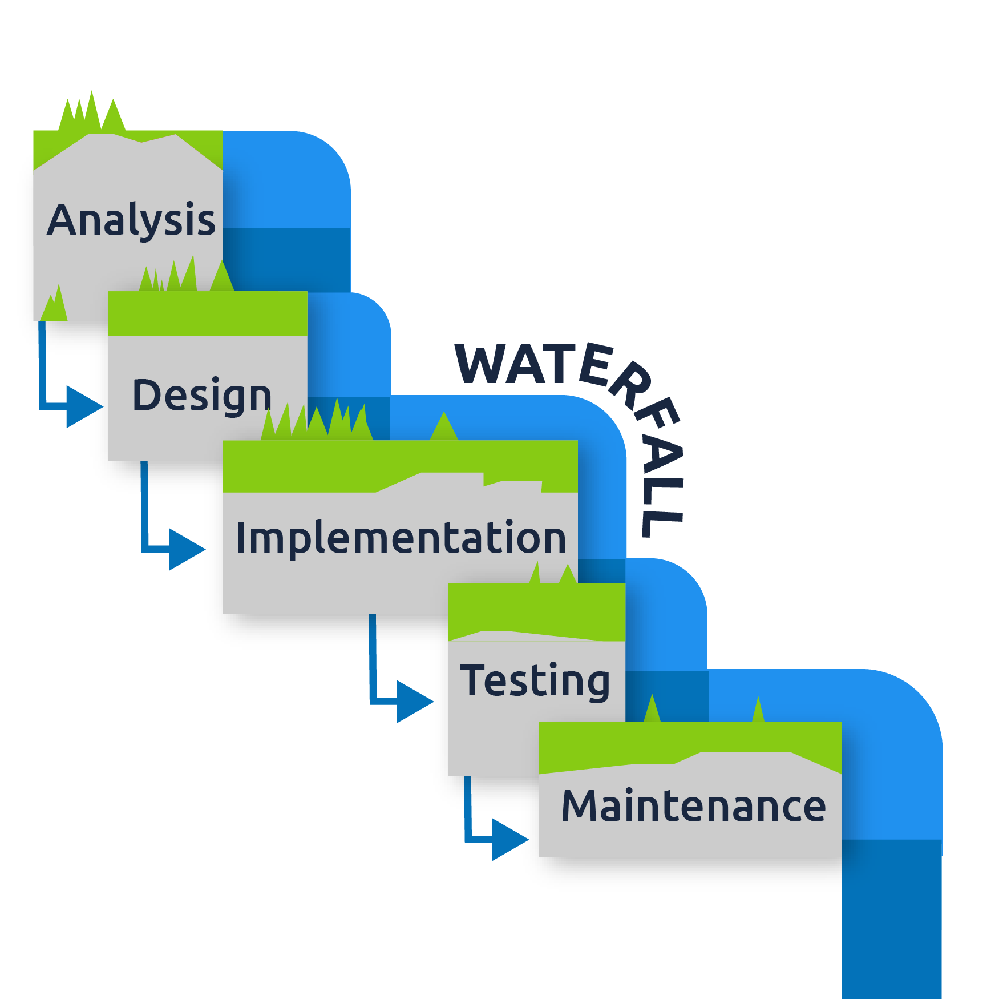
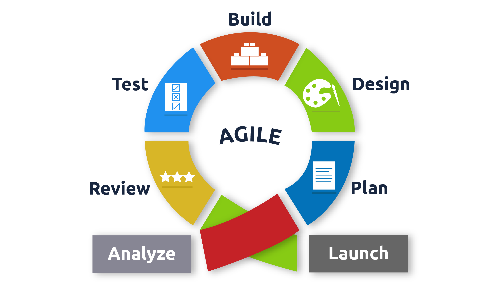

## Introduction

In this lab, you'll explore the evolution of Software Development styles over the years, understanding their impact on the security industry.

## Learning Objectives

- Explore the history and evolution of software development practices.
- Understand the importance and concepts of DevSecOps.
- Dive into DevSecOps culture and its discipline.

## DevSecOps Learning Path

This room is the first step in a new DevSecOps learning path, covering:

1. Introduction to DevSecOps (Secure SDLC, Environments, and Tools)
2. Security of the Pipeline (Pipeline Automation, Source Code Security, Automated Code Testing, Dependency Management, CI/CD, and Environment Security)
3. Security in the Pipeline (Attacking the Pipeline, Exploiting Vulnerabilities, Defending the Pipeline)
4. Infrastructure as Code (Cloud DevOps, Secret Management, Exploiting Terraform, Vagrant, Docker)

## The Story of DevOps

### Waterfall Model

The traditional approach to project management in the 70s, where each team member had specific responsibilities. However, it led to friction and inefficiency due to blame games and backlog accumulation.

### Agile Model

Introduced in the early 2000s, Agile focused on flexibility and adaptability, with an emphasis on collaboration and responsiveness.

### DevOps: A New Hope
In 2008, DevOps emerged from a conversation between Andrew Clay and Patrick Debois. It emphasized cultural change, integration, and automation, enabling better collaboration between teams.

### Importance of DevOps
DevOps fosters trust and collaboration between developers and other teams, aligning technological projects with business requirements. It enables small, reversible changes and improves communication, leading to increased efficiency.

### Summary of DevOps Impact
- Automated development infrastructure
- Continuous Integration and Deployment (CI/CD)
- Infrastructure-as-Code (IaC)
- Dynamic provisioning of containerized workloads

For more details, visit [History of DevOps](https://www.appknox.com/blog/history-of-devops).

# The Infinte Loop

## Introduction to DevOps Concepts and Tools

In the previous task, we explored the evolution of software development styles and how they contributed to the inception of DevOps. This task introduces key concepts, tools, and their integration within the DevOps framework.

### How DevOps Works

DevOps is visualized as an infinite loop, encompassing various phases of the development lifecycle.

### Key DevOps Tools & Processes

#### CI/CD (Continuous Integration and Continuous Deployment)
- Enables frequent merging of code and automated testing.
- Detects bugs early and facilitates reliable rollbacks of code versions.

#### Infrastructure as Code (IaC)
- Manages and provisions infrastructure through code and automation.
- Enables consistent resource creation and management using tools like Terraform and Vagrant.

#### Configuration Management
- Manages infrastructure state efficiently, making it more maintainable.
- Provides visibility into infrastructure configuration, often used alongside IaC.

#### Orchestration
- Automates workflows to achieve stability and fast responses to issues.
- Enables efficient resource planning and management, often integrated with monitoring.

#### Monitoring
- Collects data about service and infrastructure performance.
- Facilitates faster recovery, cross-team visibility, and root-cause analysis.
- Enables automated responses to issues.

#### Microservices
- Architecture that breaks applications into small, independent services.
- Offers benefits such as scalability, reduced complexity, and technology flexibility.

These concepts and tools are foundational to the DevOps philosophy and will be further explored in the DevSecOps pathway.

## Shifting Left in DevOps

### Introduction

DevOps facilitates the integration of security from the earliest stages of the development lifecycle, promoting collaboration between development and security teams. This approach, often referred to as "Shifting Left," significantly reduces risks and enhances the overall security posture of software products.

### Shifting Left Concept

Traditionally, security testing occurred at the end of the development cycle, leading to delays and friction between teams. Shifting left involves implementing security measures throughout the entire development lifecycle, ensuring that security best practices are built into the software design. Early detection of security flaws reduces remediation costs and prevents rollbacks, thereby improving efficiency and trust.

### Why Shifting Left?

The shift towards agile development and automated provisioning of infrastructure in the cloud has accelerated development productivity. However, this increased velocity can introduce security concerns and flaws that may go unnoticed. Shifting left ensures that security vulnerabilities are identified early, preventing issues from escalating and aligning with the fast-paced development environment.

### Benefits of Shifting Left

- Early detection of security flaws
- Lower remediation costs
- Improved efficiency and trust
- Alignment with agile development principles
- Enhanced security posture

### Conclusion

DevOps emphasizes the early integration of security into the development cycle, minimizing risks and improving the overall quality of software products. By blending security practices with DevOps principles, organizations can mitigate potential threats and meet the evolving challenges of cybersecurity.

## DevSecOps: Automating Security in Development

### Introduction

DevSecOps integrates security as a shared responsibility in a culture-driven development style, relying heavily on automation and platform design.

### Value of DevSecOps

- Reduces vulnerabilities
- Maximizes test coverage
- Intensifies automation of security frameworks
- Mitigates risks, preventing brand reputation damage and economic losses
- Simplifies auditing and monitoring

### Efficient Implementation

- **Culture is Key**: Open communication and trust are essential.
- **Collective Effort**: Bridging security knowledge gaps between teams.
- **Autonomy and Confidence**: Providing tools and knowledge to drive security efficiently.

### Challenges in DevSecOps Implementation

#### Security Silos
- Security portrayed as a separate entity
- Specialized security teams create silos
- Security should be a supportive function shared across teams

#### Lack of Visibility & Prioritization
- Aim for security as a regular aspect of development
- Build trust between teams to focus on development confidently

#### Stringent Processes
- Flexibility in procedures for new experiments or software
- Different treatment for lower-level tasks and higher-risk changes

#### SandBox Environments
- Temporarily isolated environments for testing new software
- No connection to internal networks or customer data

DevSecOps promotes a collaborative approach to security, ensuring that security is integrated throughout the development lifecycle while fostering autonomy and trust between teams.

## DevSecOps Culture

### Promoting Autonomy of Teams

- Automate processes seamlessly integrated with the development pipeline.
- Security tests become routine, like unit testing.
- Promote education through playbooks/runbooks to spot and fix security flaws independently.
- Understand the ratio difference between security engineers and other team members.
- Security acts as a supporting function, building trust and knowledge overlap between teams.

### Visibility and Transparency

- Provide visibility on the security state of services owned or maintained by teams.
- Use dashboards to visualize security flaws and prioritize tasks accordingly.
- Ensure transparency by making tools and practices accessible to teams.
- Developers/engineers should have access to information flagged by analysis tools.
- Promote education and autonomy through increased transparency traditionally accessible to security teams.

### Flexibility and Understanding

- Understand the level of risk from different team perspectives.
- Account for flexibility in processes based on team priorities and deadlines.
- Build processes based on understanding and empathy towards how teams work.
- Adapt processes to fit unique situations and changes in bandwidth over time.
- Gain buy-in and demonstrate value by aligning security measures with team priorities and perspectives.

Understanding and empathy are crucial for successfully integrating security into DevOps processes, promoting flexibility, and building trust between teams.
