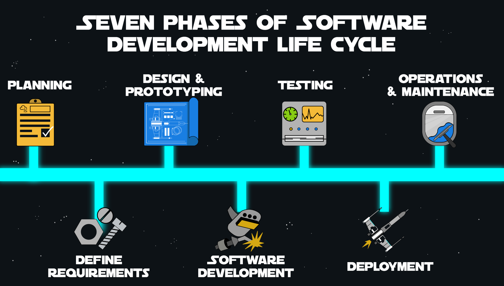

## Introduction to Software Development Lifecycle (SDLC)

### Overview

This room delves into the Software Development Lifecycle (SDLC) framework, exploring its phases and components.

### Learning Objectives

By the end of this room, you will:

- Understand the significance of the SDLC framework in software development.
- Learn about the different phases of the SDLC.
- Discover methods to incorporate security into the SDLC.
- Gain insights into the phases and processes of Security SDLC.

Stay tuned to embark on a journey through the intricacies of the SDLC and its pivotal role in software development.

## What is Software Development Lifecycle (SDLC)?

The Software Development Lifecycle (SDLC) is a framework comprising practices aimed at standardizing the development of software applications. It defines tasks to be executed at each stage of software development, with the goal of enhancing software quality, meeting customer expectations, and adhering to deadlines and cost estimates. By providing insights and analysis at each stage, SDLC maximizes efficiency and reduces costs, thereby improving the overall development process.

### How does SDLC work?

SDLC guides the creation of software applications by dividing tasks into phases, each with specific objectives. These phases are typically divided into 6-8 stages:

1. **Planning:** All aspects of project and product management, including resource allocation and scheduling.
2. **Requirements Definition:** Determining the application's functionality and requirements.
3. **Design & Prototyping:** Establishing the software's architecture, communication methods, and programming language.
4. **Software Development:** Writing code and documentation to build the program.
5. **Testing:** Ensuring components function correctly and interact seamlessly.
6. **Deployment:** Making the application available to users.
7. **Operations & Maintenance:** Responding to issues, bugs, and planning future features.

These phases can be adjusted or merged based on the specific needs of the project or the chosen Software Development Model, such as Waterfall, Agile, or DevOps. For instance, testing may be integrated with development phases in scenarios where security is addressed throughout the development process. 

SDLC serves as a roadmap for software development, enabling organizations to establish repeatable processes and predict outcomes for future projects.

## Introduction

The initial phases of software development involve breaking down the project or application before proceeding with its development.

### 1. Planning

During the Planning Phase, also known as the Feasibility Stage, the scope and purpose of the application are determined. This phase helps in keeping the project focused on its original purpose while setting boundaries. It involves defining the system's problem and scope, determining the requirements for its design, and identifying the necessary resources to execute the plan. The planning stage is crucial for meeting project deadlines and ensuring readiness for market release.

### 2. Requirements Definition

The Requirements Definition stage involves gathering all necessary details and defining prototype ideas. This includes making a list of requirements, evaluating alternatives, and identifying end-user needs through research and analysis. Defining requirements helps in determining what the application should do and its essential features. Developers often produce a Software Requirement Specification (SRS) document to document these requirements.

### 3. Design and Prototyping

In this phase, developers outline the overall application details, including interfaces, network requirements, and database instances. The Software Requirement Specification (SRS) is converted into logical structures implemented in programming languages. An Architecture Design Review (ARD) document is created to ensure alignment among different teams involved in various areas of development. Design and Prototyping also involve specifying architecture, user interfaces, platform, communication methods, and application security measures.

### 4. Software Development

During Software Development, code is written and the application is developed based on specifications outlined in earlier design documents. Developers follow coding guidelines and use tools like compilers, debuggers, and interpreters to ensure code quality and adherence to organizational standards. Documentation, playbooks, and guides are essential parts of the development process, promoting secure coding practices and providing instructions for application development.

## Introduction

The final phases of the Software Development Lifecycle (SDLC) focus on testing the application before release and maintaining its healthy operability afterwards.

### 5. Testing

Testing is critical to ensure the quality of an application before it is made available to users. During this stage, developers review their software using automated tools like source code scanners to meet the quality standards defined in earlier stages of the SDLC. Introducing testing effectively requires going through phases such as test case design and development, test environment setup, and test execution.

#### Test Case Design and Development

In this phase, the QA team creates detailed test cases to validate functionality and meet requirements. Test cases should be simple, identifiable, and repeatable, and they may require maintenance or updates over time.

#### Test Environment Setup

Testers establish the parameters of the test environment, including hardware, software, test data, and configurations, to support testing activities effectively.

#### Test Execution

Testers execute all test cases, identify and report bugs, and log the system's performance compared to its requirements. Regression testing ensures that new fixes do not introduce new flaws into production.

### 6. Deployment

After testing, the software design comes together, and modules or configurations are integrated into the primary source code. Automated deployment tools are often used to release new applications, allowing for rollbacks if needed.

### 7. Operations and Maintenance

In this phase, developers handle issues reported by end-users and implement changes required after deployment. Operations teams focus on stability and uptime, enabling self-service for developers, standardizing tooling and processes, and bringing automation to traditional operations tasks.

## Keep CALMS

CALMS, coined by Jez Humble, assesses a company's DevOps readiness: Culture, Automation, Lean, Measurement, and Sharing.

### Culture

DevOps requires a cultural shift towards collaboration and agility. Teams break projects into smaller tasks for iterative development, involving not only developers but also QA, product management, and operations.

### Automation

Automation is central to DevOps for reliable and repeatable integrations. It starts with continuous delivery and extends to continuous integration and configuration as code for streamlined production-ready code builds.

### Lean

DevOps promotes lean practices, encouraging small, iterative improvements over perfection. By releasing lean versions sooner, teams can gather user feedback and iterate based on real-world usage.

### Measurement

Effective DevOps relies on metrics for continuous improvement. Key metrics track performance, deployment frequency, lead time, and mean time to recovery, enabling iterative process enhancements.

### Sharing

In DevOps, there's a shared responsibility across teams. Development, operations, and other stakeholders collaborate to deliver and maintain the final solution, fostering a culture of shared ownership and accountability.

## DevOps Metrics

During the process of manually creating infrastructure, deployments are blocked. There may be too many errors in the live application, indicating that the security test automation needs to be improved or is taking too much computing power and time. Understanding how and where to find improvement requires metrics to measure your resources. Here are the essential metrics gathered by engineers and the questions it aims to answer:

**Meantime to production (MTTP)**  
What is the turnaround time for newly committed source code?  

**Frequency of deployment**  
What is the frequency of deployment of releases? The average lead time. How long does it take to develop, build, test, and deploy a new feature?  

**Speed of deployment**  
A new release is deployed into production; how long does it take?  

**Deployment Agility**  
You can measure deployment agility by combining deployment speed and frequency.  

**Production failure rate**  
How often do failures occur in production?  

**MTTR** stands for mean time to recover.  
What is the recovery time after a failure?  

### MTTP

One critical DevOps metric to track is the mean time production. MTTP is the length of time between when a code change is committed and when it is in a deployed state. A pre-release test, for instance, is passed when all code requirements have been met. Test automation and working in small batches are good ways to improve MTTP time. Developers can receive fast feedback on the code they commit by following these practices, identifying flaws, and fixing them as quickly as possible.   

### Failure Rate

When a code change goes into production, a certain percentage of code changes require hot fixes or other remediation measures. It does not measure failures caught during testing and fixes before the code is deployed. The same practices that enable shorter MTTP times correlate with reducing change failure rates. All these practices make bugs much easier to identify and remediate. Tracking and reporting failure rates are essential for ensuring new code releases meet security requirements.

### Deployment frequency

Understanding how often new code is deployed into production is critical to DevOps' success. Deployment frequency defers to MTTP as it measures when it's released into a pre-production staging environment and reserves "deployment" to refer to code changes released into production. Teams can deploy changes on-demand and often many times a day. The ability to deploy on-demand requires a deployment pipeline that incorporates automated testing and feedback mechanisms, as mentioned in the previous tasks, minimising the need for human intervention. 

### MTTR

When a partial or total service interruption occurs, the mean time to recovery (MTTR) is measured. Keeping track of this metric is crucial. If a failure occurs, a fix must be deployed as soon as possible, or the changes that caused the failure must be rolled back. In most cases, this involves monitoring system health continuously and alerting operations in the event of a failure. The operations team have the necessary processes, tools, and permissions to resolve incidents. 

### Communicating Risk

You can demonstrate improvement over time by measuring any of these, and you'll have the evidence to support the buy-in from the business and teams. Risk means very different across teams. For DevSecOps engineers, risk means the likelihood of a vulnerability being exploited and its impact on systems. Whereas for a DevOps engineer, a significant risk would be high rates of production failure, for example. By understanding other teams' definitions of risk, a DevSecOps engineer can find common ground and better build a perception of security risk for other teams.
