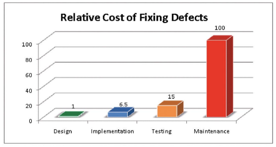
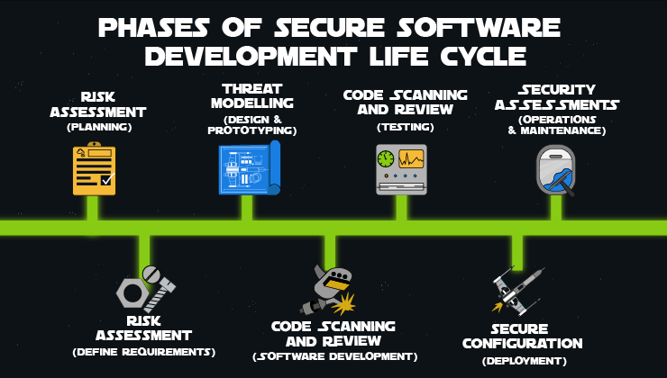
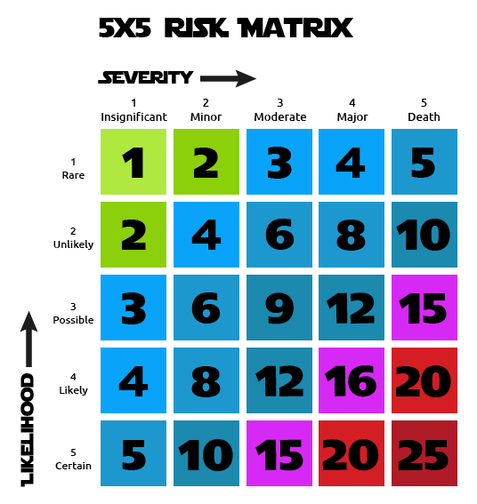
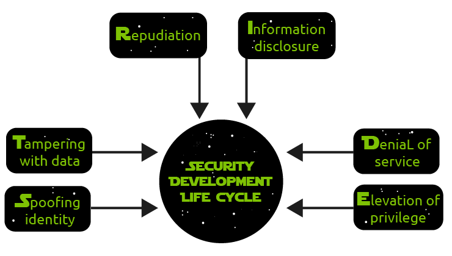
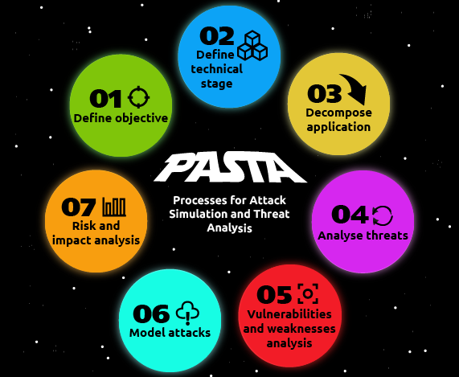

# Secure Software Development Lifecycle (SSDLC)

During SDLC, security testing was introduced very late in the lifecycle. Bugs, flaws, and other vulnerabilities were identified late, making them far more expensive and time-consuming to fix. In most cases, security testing was not considered during the testing phase, so end-users reported bugs after deployment. Secure SDLC models aim to introduce security at every stage of the SDLC.

## Why is Secure SDLC Important?

A study conducted by the Systems and Sciences Institute at IBM discovered that it costs six times more to fix a bug found during implementation than one identified as early as during the design phase. It also reported that it costs 15 times more if flaws are identified during testing and up to 100 times more costly if identified during the maintenance and operation phases. See the figure below:

*Source: The research paper on the cost of identifying vulnerabilities can be found here.*

Apart from faster development and reduction of costs, integrating security across the SDLC helps discover and reduce vulnerabilities early, reducing business risk massively. Examples of introducing security at all stages are architecture analysis during design, code review and scanners during the development stage, and conducting security assessments (e.g., penetration tests) before deployment. For example, in waterfall models, this sort of testing was carried out at the end of the lifecycle, right before production; in more agile processes, we can implement a "security by design" approach. If the pentests result in errors like an SQL injection in a waterfall scenario, mitigating the bugs would entail doing another cycle to fix the bug. It would require redesigning, applying the changes, and retesting to check it has been remediated. In a more agile approach, discussions on whether to prevent flaws like this, such as deciding on parameterisation during the planning phase, can avoid having to roll back changes, and it only costs a planning discussion.

## Summary

- **Security is a constant concern:** Improving software quality and security constantly.
- **Boosting security education and awareness:** All stakeholders know each phase's security recommendations and requirements.
- **Early flaw detection:** Flaws are detected early before deployment, reducing the risk of getting hacked or disrupted.
- **Cost and speed efficiency:** Costs are reduced, and speed increases, thanks to the early detection and resolution of vulnerabilities.
- **Risk reduction:** Business risk, brand reputation damage, and fines that could lead to economic disaster for a company are prevented.

# Implementing SSDLC

As the Intro to DevSecOps room shows, Secure SDLC involves instilling security processes at all lifecycle phases, from security testing tools to writing security requirements alongside functional requirements.

## Understanding Security Posture

Like with every new process, understanding your gaps and state is critical for successfully introducing a new tool, solution, or change. To help grasp what your security posture is, you can start by doing the following:

- **Perform a Gap Analysis:** Determine what activities and policies exist in your organization and how effective they are. For example, ensure policies are in place (what the team does) with security procedures (how the team executes those policies).
- **Create Software Security Initiatives (SSI):** Establish realistic and achievable goals with defined metrics for success. For example, a Secure Coding Standard, playbooks for handling data, etc., tracked using project management tools.
- **Formalize Processes for Security Activities:** After starting a program or standard, spend an operational period helping engineers familiarize themselves with it and gather feedback before enforcing it. When performing a gap analysis, every policy should have defined procedures to make them effective.
- **Invest in Security Training:** Provide engineers with appropriate tools and ensure they are aware of new processes and the tools that will come with them to operationalize them. Invest in training early, ideally before establishing or onboarding the tool.

## SSDLC Processes

After understanding your security posture, now is the time to prioritize and instill security in your SDLC. Generally speaking, a secure SDLC involves integrating processes like security testing and other activities into an existing development process. Examples include writing security requirements alongside functional requirements and performing an architecture risk analysis during the design phase of the SDLC. These processes are the following:

### Risk Matrix 

- **Risk Assessment:** During the early stages of SDLC, identify security considerations that promote a security-by-design approach when functional requirements are gathered in the planning and requirements stages. For example, if a user requests a blog entry from a site, ensure the user cannot edit the blog or remove unnecessary input fields.
- **Threat Modelling:** Identify potential threats when there is a lack of appropriate safeguards. It is effective following a risk assessment and during the design stage of the SDLC, as Threat Modelling focuses on what should not happen. In contrast, design requirements state how the software will behave and interact. For example, ensure verification when a user requests account information.
- **Code Scanning / Review:** Code reviews can be either manual or automated. Code scanning or automated code reviews can leverage Static and Dynamic Security testing technologies. These are crucial in the development stages as code is being written.
- **Security Assessments:** Penetration Testing and Vulnerability Assessments are automated tests that can identify critical paths of an application that may lead to the exploitation of a vulnerability. Vulnerability Assessments do not carry out attack simulations, whereas Pentesting identifies flaws and attempts to exploit them to demonstrate validity. Pentests and Vulnerability Assessments are carried out during the Operations & Maintenance phase of the SDLC after a prototype of the application.

There are methodologies to apply the processes in task 5 that will help you navigate and guide you when introducing risk assessment, threat modelling, scanning and testing, and operational assurance. The following tasks will cover these processes in more detail.

# Risk Assessment

Risk refers to the likelihood of a threat being exploited, negatively impacting a resource or the target it affects. For example, vulnerabilities being exploited after a new version of the software is published, design flaws, and poorly reviewed code can increase the risk of these scenarios. Risk management is an important pillar to integrate into the SDLC to mitigate risk in a product or service.

Risk assessment is used to determine the level of the potential threat. Risk identified in the risk assessment process can be reduced or eliminated by applying appropriate controls during the risk mitigation process. Usually, a risk assessment is followed by threat modelling, which will be explained further in the next section.

## Performing a Risk Assessment

The first step in the risk assessment process is to assume the software will be attacked and consider the factors that motivate the threat actor. List out the factors such as the data value of the program, the security level of companies who provide resources that the code depends on, the clients purchasing the software, and how big the software is distributed (single, small workgroup, or released worldwide). Based on these factors, write down the acceptable level of risk. For instance, a data loss may cause the company to lose millions, especially if they have to pay fines due to regulations like GDPR, but eliminating all potential security bugs in the code may cost $40,000. The company and other stakeholder groups have to decide whether it is worth it; it is also crucial to communicate these tradeoffs. Hence, everyone understands the risk and its implications. From a brand reputation perspective, if the attack damages the company's image, it could cost the company more in the long run than fixing the code.

The next step is risk evaluation. Include factors like the worst-case scenario if the attacker successfully attacks the software. You can demonstrate the worst-case scenario to executives and senior engineers by simulating a ransomware attack. Determine the value of data to be stolen, valuable data such as the user's identity, credentials to gain control of the endpoints on the network, and data or assets that pose a lower risk. Another factor to consider is the difficulty of mounting a successful attack, in other words, its complexity. For example, if an attacker can gain access to the company's tool for giving feedback to colleagues or running retrospective meetings, it would have a lower impact than accessing a production environment's monitoring and alerts system. The high level of risk will not be acceptable, and it is best to mitigate it. For example, a vulnerability can be exploited by anyone running prewritten attack scripts or using botnets to spread the scripts to compromise computers and networks. Users affected are a vital factor.

Some attacks only affect one or two users, but the denial of service attack will affect thousands of users when a server is attacked. Moreover, thousands of computers may be infected by the spread of worms. The last factor is the accessibility of the target. Determine whether the target accepts requests across a network or only local access, whether authentication is needed for establishing a connection, or if anyone can send requests. It has more impact if an attacker accesses a production environment versus a sandbox environment used in local playgrounds for people to do labs or tutorials.

## Types of Risk Assessments

There are several types of risk assessments best suited for different scenarios. Below are the different types of risk assessments:

### Qualitative Risk Assessment

This is the most common type of risk assessment that you will find in companies. In a qualitative risk assessment, the goal is to assess and classify risk into thresholds like "Low", "Medium", and "High". It systematically examines what can cause harm and what decisions should be made to define or improve adequate control measures. Like all types of risk assessments, each level has a priority, where "High" has the most urgency. Even though qualitative risk assessments don't use numbers, a typical formula to evaluate qualitative risk is:

\[ \text{Risk} = \text{Severity} \times \text{Likelihood} \]

"Severity" is the impact of the consequence, and "Likelihood" is the probability of it happening. It is up to the risk assessor to judge these circumstances.

### Quantitative Risk Assessment

The quantitative risk assessment is used to measure risk with numerical values. Instead of "Low", "Medium", and "High", you would have numbers that represent those bands. When carrying out quantitative risk analysis, we can use tools to determine severity and likelihood or custom series of calculations based on the company's processes.

For example, suppose there are services with assigned business criticality levels. In that case, you can say that if a bug affects a business-critical service (an authentication service, a payment infrastructure, etc.), you will assign 5 points. This highlights why it is vital to understand a security posture and its processes. Measuring risk and priority with an endemic equation to a company's services will have great results. An example of a quantitative risk assessment matrix can be seen below:

Risk assessments are better performed at the beginning of the SDLC, during the planning and requirement phases. For example, "Customer data gets exfiltrated by an attack". Once the system is developed, you can perform quantitative risk analysis: "One customer can sue us for $20,000 if their data gets leaked", and we have 100 customers. However, the Annual Rate of Occurrence (ARO) is 0.001. Hence, Annual Loss Expectancy (ALE) is calculated as follows:

\[ \text{ALE} = \$20,000 \times 100 \times 0.001 = \$2,000 \]

Meaning as long as our compensating security control costs less than $2,000, we are not overspending on security.

# Threat Modelling

Threat modelling is best integrated into the design phase of an SDLC before any code is written. It is a structured process of identifying potential security threats and prioritising techniques to mitigate attacks so that data or assets classified as valuable or of higher risk during risk assessment, such as confidential data, are protected. When performed early, it brings a great advantage; potential issues can be found early and solved, saving fixing costs down the line.

There are various methods to perform threat modelling. Not all the methods have the same purpose; some focus on risk or privacy concerns, while some are more customer-focused. We can combine these methods to understand potential threats better; it is essential to analyse which way aligns more with the project or business. STRIDE, DREAD, and PASTA are among the common threat modelling methodologies.

## STRIDE

STRIDE stands for Spoofing, Tampering, Repudiation, Information Disclosure, Denial of Service, and Elevation/Escalation of Privilege. STRIDE is a widely used threat model developed by Microsoft which evaluates the system's design in a more detailed view. We can use STRIDE to identify threats, including the property violated by the threat and definition. The system's data flow diagram is to be developed in this model, and each node is applied with the STRIDE model. Identifying security threats is a manual process that tools do not support and should be carried out during the risk assessment. Using data flow diagrams and integrating STRIDE, the system entities, attack surfaces, known boundaries, and attacker events become more identifiable. Here are the components of the framework:

- **Spoofing**: Impersonation of a user by a malicious actor which violates the authentication principle from the perspective of the CIA triad. Common ways include ARP, IP, and DNS spoofing.
- **Tampering**: Modification of information by an unauthorized user, violating the integrity principle of the CIA triad.
- **Repudiation**: Not taking responsibility for events where the actions are not attributed to the attacker, violating the principle of non-repudiability. For example, the attacker clears up all the logs that could lead to leaving traces.
- **Information Disclosure**: Violation of confidentiality of the CIA triad. A typical example is data breaches.
- **Denial of Service**: Occurs when an authorized user cannot access the service, assets, or system due to the exhaustion of network resources, violating the availability principle of the CIA triad.
- **Elevation/Escalation of Privilege**: Escalating privileges to gain unauthorized access, violating the authorization principle of the CIA triad.

## DREAD

DREAD stands for five questions about each potential threat: Damage Potential, Reproducibility, Exploitability, Affected Users, and Discoverability. DREAD is also a methodology created by Microsoft which can be an add-on to the STRIDE model. It's a model that ranks threats by assigning identified threats according to their severity and priority. Here are the components of the framework:

- **Damage**: Refers to the possible damage a threat could cause to the existing infrastructure or assets. It is based on a scale of 0–10. 
  - 0: No harm
  - 5: Information Disclosure
  - 8: User data compromised
  - 9: Internal or administrative data compromised
  - 10: Unavailability of a service
- **Reproducibility**: Measures the complexity of the attack, how easily a hacker can replicate a threat.
  - 0: Nearly impossible to copy
  - 5: Complex but possible
  - 7.5: Authenticated user
  - 10: Attacker can reproduce very quickly without any authentication
- **Exploitability**: Refers to the attack's sophistication or how easy it would be to launch the attack.
  - 2.5: Requires advanced skill set of networking and programming skills
  - 5: Can be exploited with available tools
  - 9: Needs a simple web application proxy tool
  - 10: Can exploit through a web browser
- **Affected Users**: Describes the number of users affected by the successful exploitation of a vulnerability.
  - 0: No affected users
  - 2.5: Individual user
  - 6: Small group of users
  - 9: Significant users like administrative users
  - 10: All users affected
- **Discoverability**: Process of discovering the vulnerable points in the system.
  - 0: Challenging to discover
  - 5: Discoverable by analysis of HTTP requests
  - 8: Easily found as it's public-facing
  - 10: Visible in the browser address bar

## PASTA

PASTA stands for Process for Attack Simulation and Threat Analysis; it is a risk-centric threat modelling framework. PASTA's focus is to align technical requirements with business objectives. PASTA involves the threat modelling process from analysing threats to finding ways to mitigate them, but on a more strategic level and from an attacker's perspective. PASTA is divided into seven stages:

1. **Define Objectives**: Note the structure and define objectives. This ensures the relevant assets are threat-modelled by defining an asset scope.
2. **Define Technical Scope**: Define architectural diagrams, both logical and physical infrastructure. This helps in mapping the attack surface and dependencies from the environment.
3. **Decomposition & Analysis**: Each asset will have a defined trust boundary that encompasses all its components and data. For example, mapping threat vectors for a payment service and evaluating which components underlying the service can be leveraged for an attack.
4. **Threat Analysis**: Refers to the extracted information obtained from threat intelligence. This is useful to identify which applications are vulnerable to specific vectors.
5. **Vulnerabilities & Weaknesses Analysis**: Analyses the vulnerabilities of web application security controls and identifies security flaws in the application. Mitigation should be added to the identified threat in this stage.
6. **Attack/Exploit Enumeration & Modelling**: Map out the possible threat landscape and the entire attack surface of the web application. Identify exploits and attack paths.
7. **Risk Impact Analysis**: Based on the collective data from the previous stages, analyse the affected assets and document recommended steps to mitigate the risks and eliminate residual risks.

# Secure Code Review & Analysis

## Introduction

According to research conducted by Verizon in 2020 on Data Breaches, 43% of breaches were attacks on web applications, while some other security breaches resulted from vulnerabilities in web applications. Implementing a secure code review in the phases of an SDLC, especially during the implementation phase, will increase the resilience and security of the product without bearing additional costs for future patches. Secure code review is defined as a measure where the code itself is verified and validated to ensure vulnerabilities can be mitigated and removed to avoid vulnerabilities and flaws. Having developers be aware and proactive in reviewing the code during development can result in faster mitigation responses and fewer unattended threats. Reviewing code is a crucial step in the SDLC for developers. It prevents any setbacks on the release and issues exposed to the users. As shown in the previous SSDLC task, the cost of the project itself and the effort put in is proportional and cheaper in the long run than the cost of applying code reviews and analysis. By implementing this approach, the organization will also be compliant with the standards set by government bodies and certifications.

## Types of Code Review

### Manual Code Review

A manual code review is where an expert analyzes and checks the source code by going line by line to identify vulnerabilities. Therefore, a high-quality manual code review requires the expert to communicate with the software developers to get hold of the purpose and functionalities of the application. The analysis output will then be reported to the developers if there is a need for bug fixing.

### Automated Code Review

Automated Static Application Security Testing (SAST) automatically analyzes and checks the source code. 

## Code Analysis

### Static Analysis

Static analysis examines the source code without executing the program. Static analysis detects bugs at the implementation level.

### Dynamic Analysis

Dynamic analysis looks at the source code when the program is running. Dynamic analysis detects errors during program runtime.

## SAST

SAST stands for Static Application Security Testing, a white box testing method that directly analyzes the source code.

### Why is it Static?

Because the test is done before an application is live and running. SAST can even help detect vulnerabilities in your application before the code is merged or integrated into the software if added as part of the SDLC development phase.

### How Does SAST Work?

SAST uses a testing methodology of analyzing source code to detect any traces of vulnerabilities that could provide a backdoor for an attacker. SAST usually analyzes and scans an application before the code is compiled.

# Security Assessment

A security assessment plays a primary role in achieving security in the SDLC and should be implemented in all phases where possible. Security testing assesses a system, software, or web application for vulnerabilities and other attack vectors. Because they test from a holistic point of view of the application, they are usually carried out at the end of the SDLC, in the Operations and Maintenance phase, once the version has included all the working components and updates. There are two types of assessments: Penetration Testing and Vulnerability Assessment. Usually, a company employs and authorizes external security testers to attempt to break into a company’s network and systems legally.

## Vulnerability Assessment

Vulnerability Assessments focus on finding vulnerabilities but do not validate them or simulate the findings to prove they are exploitable in reality. Typically, automated tools run against an organization's network and systems. Examples of tools are OpenVAS, Nessus (Tenable), and ISS Scanner. These scanners probe ports and services on systems across various systems and IP addresses. Other activities include checking service versions against a database of vulnerabilities affecting said version. The result is a report with a list of vulnerabilities usually found, with an automated threat level severity classification, e.g., High/Medium/Low or an assigned CVSS score.

## Penetration Testing

Penetration Testing includes vulnerability testing but goes more in-depth. It is extended by testing/validating vulnerabilities, quantifying risks, and attempting to penetrate systems. For example, trying to escalate privileges after a vulnerability is found. Some vulnerabilities can be lower risk but can be used as leverage to cause more damage. The tester can provide a thorough report with suggested countermeasures to mitigate the vulnerabilities. This makes it easier to understand the threats by demonstrating the actual risk, for example, recovering an employee password by exploiting the mentioned vulnerability.

## Pros and Cons

### Vulnerability Assessment

**Pros**
- Suitable for quickly identifying potential vulnerabilities
- Part of the Penetration Test
- Better for Budget, they are cheaper than Pentests

**Cons**
- Can produce a large number of reports
- Quality depends on the tool used
- Real-life scenarios for vulnerabilities are not considered (it could be behind a proxy or only exploitable with social engineering/credentials)
- The low-risk vulnerability may be used as part of a more powerful attack.

### Penetration Testing

**Pros**
- Tester shows organizations what an attacker could do.
- How any vulnerabilities could be used against it by attackers – the real risk
- Can be shown to the customer

**Cons**
- Very Expensive
- Requires extensive planning and time to carry out the tests

# SSDLC Methodologies

You can follow different methodologies to best integrate security into the SDLC. Regardless of the chosen development methodology (Agile, DevOps, Extreme Waterfall, etc.), there is a need to:

- Build with security in mind
- Introduce testing focused on security

Several methodologies for SDLC are widely used:

## Microsoft's Security Development Lifecycle (SDL)

### SDL Principles
- **Secure by Design**: Security is a built-in quality attribute affecting the whole software lifecycle.
- **Security by Default**: Software systems are constructed to minimize potential harm caused by attackers, e.g., software is deployed with the least necessary privilege.
- **Secure in Deployment**: Software deployment is accompanied by tools and guidance supporting users and administrators.
- **Communications**: Software developers are prepared for occurring threats by communicating openly and timely with users and administrators.

SDL is a collection of mandatory security activities grouped by the traditional software development lifecycle phases. Data is collected to assess training effectiveness. In-process metrics are used to confirm process compliance. Post-release metrics are used to guide future changes. SDL places heavy emphasis on understanding the cause and effect of security vulnerabilities. A development team must complete the mandatory security activities to comply with the Microsoft SDL process. You can implement SDL by following these practices:

### Practices

| Practice | Why? |
| -------- | ---- |
| **Provide Training** | Engineers, program, and product managers must understand security basics and know how to build security into software and services to make products more secure while still addressing business needs and delivering user value. Practical training will complement and re-enforce security policies, SDL practices, standards, and software security requirements and be guided by insights derived through data or newly available technical capabilities. |
| **Define Security Requirements** | Considering security and privacy is a fundamental aspect of developing highly secure applications and systems. Regardless of the development methodology being used, must continually update security requirements to reflect changes in required functionality and changes to the threat landscape. |
| **Define Metrics and Compliance Reporting** | It is essential to define the minimum acceptable levels of security quality and hold engineering teams accountable for meeting those criteria. Defining these early helps a team understand risks associated with security issues, identify and fix security defects during development, and apply the standards throughout the entire project. |
| **Perform Threat Modeling** | This practice allows development teams to consider, document, and discuss the security implications of designs in their planned operational environment and in a structured fashion. Applying a structured approach to threat scenarios helps a team more effectively and less expensively identify security vulnerabilities, determine risks from those threats, make security feature selections and establish appropriate mitigations. |
| **Establish Design Requirements** | The SDL is typically thought of as assurance activities that help engineers implement "secure features," in that the features are well-engineered concerning security. Engineers will normally rely on security features, such as cryptography, authentication, logging, etc. In many cases, the selection or implementation of security features has proven so complicated that design or implementation choices are likely to result in vulnerabilities. Therefore, it's crucially essential to apply these consistently and with a consistent understanding of their protection. |
| **Define and Use Cryptography Standards** | It's critically important to ensure all data, including security-sensitive information and management and control data, is protected from unintended disclosure or alteration when transmitted or stored. Encryption is typically used to achieve this. E.g., only use industry-vetted encryption libraries and ensure they're implemented to allow them to be easily replaced if needed. |
| **Manage the Security Risk of Using Third-Party Components** | When selecting third-party components to use, it's essential to understand the impact of a security vulnerability on the security of the more extensive system into which they are integrated. Having an accurate inventory of third-party components and a plan to respond when new vulnerabilities are discovered will go a long way toward mitigating this risk. |
| **Use Approved Tools** | Define and publish a list of approved tools and their associated security checks, such as compiler/linker options and warnings. Engineers should strive to use the latest version of approved tools, such as compiler versions, and take advantage of new security analysis functionality and protections. |
| **Perform Security Testing (SAST, DAST, IAST)** | Analyzing the source code before compilation provides a highly scalable method of security code review and helps ensure that secure coding policies are being followed. The same goes for performing run-time verification of your fully compiled or packaged software checks functionality that is only apparent when all components are integrated and running. |
| **Perform Security Assessments: Vulnerability Assessment & Penetration Testing** | The objective of a penetration test is to uncover potential vulnerabilities resulting from coding errors, system configuration faults, or other operational deployment weaknesses. As such, the test typically finds the widest variety of vulnerabilities. |
| **Establish a Standard Incident Response Process** | Preparing an Incident Response Plan is crucial for helping to address new threats that can emerge over time. The plan should include whom to contact in case of a security emergency and establish the protocol for security servicing, including methods for code inherited from other groups within the organization and for third-party code. |

## OWASP's S-SDLC

### S-SDLC Principles

- SDL is a collection of mandatory security activities grouped by the traditional software development lifecycle phases.
- Data is collected to assess training effectiveness.
- In-process metrics are used to confirm process compliance.
- Post-release metrics are used to guide future changes.
- SDL places heavy emphasis on understanding the cause and effect of security vulnerabilities.
- A development team must complete the sixteen mandatory security activities to comply with the Microsoft SDL process.

### OWASP SSDLC Methodology

OWASP S-SDLC aims to build "security quality gates" to support quality and secure software made throughout the pipeline. This is done by following an Agile Security approach, where sprints are dedicated to security. Examples of sprints can include: Code reviews, authentication, authorization, input validation, and assessing technical risks like code injections. The gates comprise sprints focusing on similar building blocks like those seen in Microsoft SDL. OWASP S-SDLC Agile approach is heavily influenced and based on a "Maturity Model" approach, in particular, OWASP SAMM. The Software Assurance Maturity Model (SAMM) is an open framework to help organizations formulate and implement a software security strategy tailored to the organization's specific risks. It helps to evaluate an organization's existing software security practices, build a software security assurance program, demonstrate improvements to that program, and define and measure security activities for an organization. SAMM helps explain objectives, actions, results, success metrics, costs, etc. An example would be a security scorecard for gap analysis, for instance, in a particular area, like endpoint protection. It aims to answer "How well are we doing and where do we want to get to?".

[OWASP SAMM link](https://owaspsamm.org/)

### BSIMM

Another critical security model is the Building Security In Maturity Model (BSIMM). BSIMM is a study of real-world software security initiatives and reflects the current state of software security. BSIMM can be described as a "measuring stick" to understand your security posture by providing a comparison of other companies' security states. In other words, it does not tell you what you should do but rather what you are doing wrong. There are hundreds of organizations involved.

[BSIMM link](https://www.bsimm.com/)

