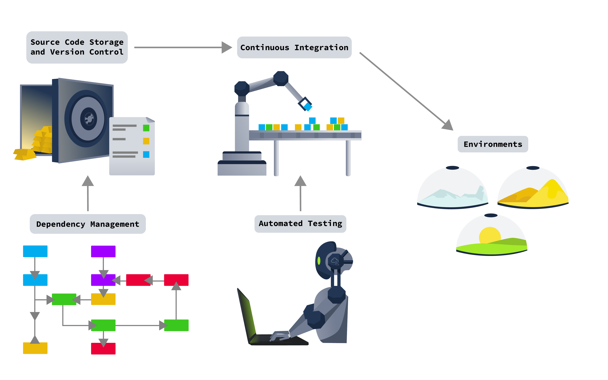

# Source Code Storage and Version Control

## Source Code Storage

When deciding where to store our code, we need to consider several factors:

- **Access Control**: How can we control who can access our source code?
- **Change Tracking**: How can we ensure that changes made to the code are tracked?
- **Integration**: Can we integrate our source code storage system with our development tools?
- **Versioning**: Can we store and actively use multiple different versions of our source code?
- **Internal vs. External Hosting**: Should we host our source code internally, or can we use an external third party to host our code?

The answers to these questions will help us choose the correct source code storage solution for our project.

## Version Control

Version control is crucial for:

- Integrating new features in our software.
- Managing code changes from multiple developers.

Version control allows us to keep track of multiple versions of the code, facilitating collaboration and ensuring code integrity.

### Common Tools

The two most common source code storage and version control systems are Git and SubVersion (SVN):
- **Git**: A distributed source control tool where each contributor has their own copy of the source code.
- **SVN**: A centralized source control tool where the repository is managed centrally.

GitHub is the largest provider of Internet hosting for software development and version control using Git. Other options include hosting your own Git server using software like Gitlab. For SVN, popular tools include TortoiseSVN and Apache SVN.

However, modern source code storage solutions like Gitlab offer more features than simple storage and version control, making them integral to the development pipeline.

## Security Considerations

Source code often contains sensitive information, so authentication and access control are crucial. We must also track changes and updates to revert to previous versions if necessary.

However, we must be cautious about storing secrets like database connection strings and credentials in our source code. Even if removed in newer versions, they may still be exposed in previous versions.

### Case Study: Git Never Forgets

Git's version control can pose security risks if sensitive information is accidentally committed to the repository. Even if removed later, this information remains accessible in the commit history. Tools like GittyLeaks can scan through historical commits and uncover sensitive data.

# Dependency Management in Software Development

## Introduction

When developing software, we rely heavily on libraries and software development kits (SDKs) to streamline our work. Managing these dependencies is a critical aspect of the development pipeline.

## External vs. Internal Dependencies

- **External Dependencies**: Publicly available libraries and SDKs hosted on external dependency managers like PyPi, NuGet, and Gems.
- **Internal Dependencies**: Libraries and SDKs developed and maintained internally by an organization.

### Security Concerns

- **Internal Dependencies**:
  - Can become legacy software.
  - Security of the package manager is our responsibility.
  - Vulnerabilities can affect multiple applications.

- **External Dependencies**:
  - Due diligence needed to ensure security.
  - Vulnerabilities can lead to supply chain attacks.
  - 0day vulnerabilities can affect multiple organizations simultaneously.

## Common Tools

- **Dependency Managers**: Used to manage external dependencies.
  - Examples: PyPi, NuGet, Gems.
- **Internal Dependency Management Tools**:
  - JFrog Artifactory
  - Azure Artifacts

## Security Considerations

- Dependencies are code outside our control.
- Tracking dependencies, especially in modern software, is challenging.
- Vulnerabilities in dependencies can lead to vulnerabilities in our application.

### Case Study: Log4Shell

- **Vulnerability**: 0day vulnerability discovered in Log4j dependency in 2021 (Log4Shell).
- **Impact**: Allowed unauthenticated attackers to gain remote code execution.
- **Widespread Use**: Dependency used in numerous products, leading to widespread vulnerability across different systems.

## Conclusion

Managing dependencies effectively is crucial for ensuring the security and stability of our software applications. It requires diligence, proper tools, and proactive security measures to mitigate potential risks associated with external and internal dependencies.

# Automated Testing in Software Development

## Introduction

Automated testing plays a crucial role in modern software development pipelines, enabling efficient and effective testing of applications and services. This section explores various types of automated testing, including their purpose, integration into CI/CD pipelines, and security considerations.

## Types of Automated Testing

### 1. Unit Testing

- Focuses on testing small parts of the application or service.
- Ensures individual components function correctly.
- Can be integrated into CI/CD pipelines as quality gates.

### 2. Integration Testing

- Tests how different parts of the application work together.
- Includes regression testing to ensure new features don't impact existing functionality.
- Integration into CI/CD pipelines for validation.

### 3. Security Testing

- **SAST (Static Application Security Testing)**:
  - Reviews source code to identify vulnerabilities.
  - Integrated into CI/CD pipelines as security gates.

- **DAST (Dynamic Application Security Testing)**:
  - Executes code to detect vulnerabilities.
  - Uses dynamic testing methods to find additional vulnerabilities.
  - Integrated into CI/CD pipelines for security validation.

### 4. Penetration Testing

- Manual testing to uncover contextual vulnerabilities.
- Complements automated testing but cannot be fully replaced.

## Common Tools

- **GitHub and GitLab**: Built-in SAST tooling.
- **Snyk and SonarQube**: Popular tools for SAST and DAST.

## Case Study: She cannae take any more captain, She's gonna blow!

- **Considerations**:
  - Performance cost of automated testing tools.
  - Integration points and calibration of results.
  - Implementation of quality and security gates.

- **Challenges**:
  - Impact on source code control tool performance.
  - Performance cost of scanning merge requests.
  - Balancing tool integration without disrupting development workflow.

## Conclusion

Automated testing, including unit testing, integration testing, and security testing, is essential for ensuring the quality, stability, and security of software applications. While automated tools offer significant advantages, careful consideration of performance, integration, and calibration is necessary to maximize their effectiveness within the development pipeline.

# CI/CD in Software Development

## Introduction

Continuous Integration and Continuous Delivery (CI/CD) is a crucial aspect of modern software development pipelines, enabling automated building, testing, integration, and deployment of new software features. This section explores the components of CI/CD pipelines, common tools used, and security considerations.

## Components of CI/CD Pipelines

1. **Starting Trigger**:
   - The action that initiates the pipeline process, such as a push request to a specific branch.

2. **Building Actions**:
   - Processes to build the project and integrate new features.

3. **Testing Actions**:
   - Actions to test the project, ensuring compatibility with existing features.

4. **Deployment Actions**:
   - Specifies what happens with the build upon successful pipeline execution, such as deployment to testing environments.

5. **Delivery Actions**:
   - Encompasses all aspects of solution delivery, including monitoring of the deployed solution.

## CI/CD Infrastructure

CI/CD pipelines rely on build infrastructure, including build orchestrators and agents. Build orchestrators direct agents to perform pipeline actions.

## Common Tools

- **GitHub and GitLab**: Provide CI/CD pipeline capabilities and build agents.
- **Jenkins**: Build orchestrator software for complex builds.

## Case Study: A Tangle Between Dev and Prod

- **Misconfiguration**:
  - Using the same build agents for both Development (DEV) and Production (PROD) builds.
  
- **Impact**:
  - Compromised DEV build could lead to a compromised build agent.
  - Attackers could inject malicious code into the PROD build, compromising the production application.

## Security Considerations

- **Attack Surface**:
  - CI/CD pipelines represent a significant attack surface.
  - Misconfigurations in pipelines can lead to severe security vulnerabilities.

- **Access Controls**:
  - Implement strict access controls to prevent unauthorized access to pipeline triggers and build agents.

- **Isolation**:
  - Maintain separate environments and build agents for DEV and PROD builds to prevent cross-contamination.

## Conclusion

CI/CD pipelines streamline the software development process but also introduce security challenges. By understanding the components of CI/CD pipelines and implementing robust security measures, organizations can mitigate risks and ensure the integrity and security of their software delivery process.

# Environments in Software Development Pipelines

## Introduction

In software development pipelines, various environments serve specific purposes, each with distinct stability levels and security postures. This section delves into common pipeline environments, their descriptions, security considerations, and notable deployment strategies.

## Common Environments

### DEV - Development
- **Description**: Playground for developers to continuously push and test new code.
- **Stability**: Unstable
- **Security Posture**: Weakest
- **Contains Customer Data**: No

### UAT - User Acceptance Testing
- **Description**: Used to test application features before production deployment.
- **Stability**: Semi-stable
- **Security Posture**: Second weakest
- **Contains Customer Data**: No

### PreProd - Pre-Production
- **Description**: Mimics production environment without real customer data.
- **Stability**: Stable
- **Security Posture**: Second strongest
- **Contains Customer Data**: No

### PROD - Production
- **Description**: Active environment serving users or customers.
- **Stability**: Stable
- **Security Posture**: Strongest
- **Contains Customer Data**: Yes

### DR/HA - Disaster Recovery or High Availability
- **Description**: Mirrors PROD environment for instant switchover or disaster recovery.
- **Stability**: Stable
- **Security Posture**: Strongest
- **Contains Customer Data**: Yes

### Green and Blue Environments
- **Description**: Used for Blue/Green deployment strategy, providing high availability during updates.
- **Stability**: Stable
- **Security Posture**: Strongest
- **Contains Customer Data**: Yes

### Canary Environments
- **Description**: Gradually migrates users to new environment to reduce PROD deployment risks.
- **Stability**: Stable
- **Security Posture**: Strongest
- **Contains Customer Data**: Yes

## Common Tools

- **Virtualisation and Containerisation**: Tools like Vagrant, Terraform, Docker, and Kubernetes create and manage environments.
- **Infrastructure as Code (IaC)**: Automates infrastructure setup and management.

## Security Considerations

- **Segregation**: Environments should be segregated, with security gates to ensure clean application transitions.
- **Infrastructure Hardening**: Harden infrastructure against attacks by removing unnecessary services, updating applications, and using firewalls.

## Case Study: Developer Bypasses in PROD

- **Issue**: Developer bypasses intended for DEV environments may make their way into PROD.
- **Example**: Inadequate sanitisation of bypasses could lead to MFA bypasses, compromising user accounts.
- **Solution**: Implement security gates to prevent bypasses from moving to production environments.

## Conclusion

Understanding and managing environments in software development pipelines is crucial for maintaining stability and security throughout the development lifecycle. By implementing proper segregation, security gates, and infrastructure hardening measures, organizations can mitigate risks and ensure the integrity of their software deployments.
