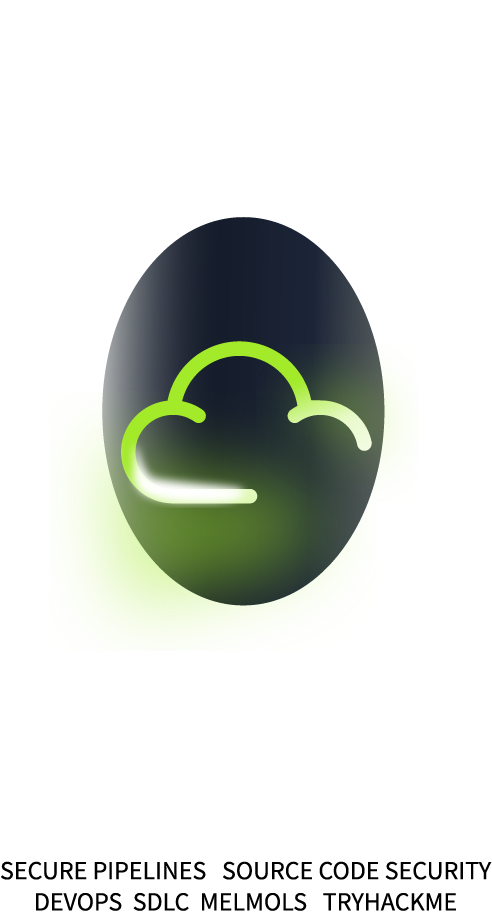
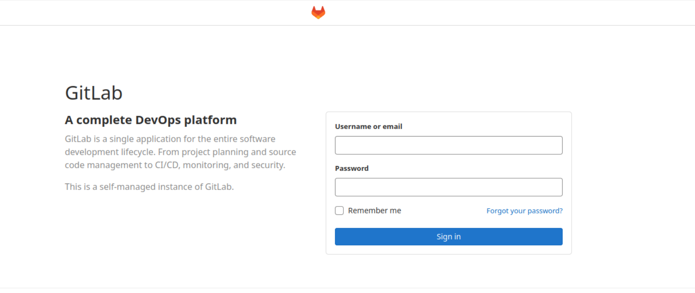
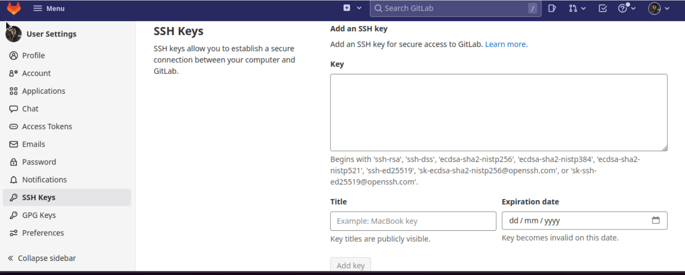
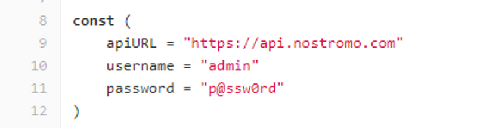
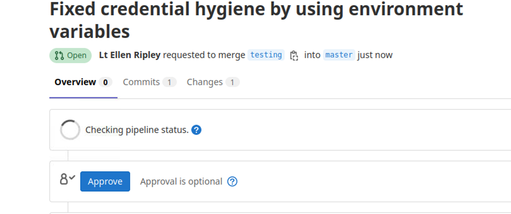

# Introduction

In today's fast-paced software development landscape, protecting your source code is crucial to ensure the integrity and confidentiality of your applications. One of the critical tools in source code management is version control, which allows teams to collaborate, track changes, and maintain a history of their codebase.
<p align="center"></p>

# Learning and Outcomes

In this room, we will delve into the fundamentals of source code storage and version control, primarily focusing on the popular version control software, Git. While there are other version control systems, such as VCS or Mercurial, Git has gained widespread adoption in the software development community due to its flexibility, scalability, and powerful features.

We will begin by understanding what version control is, why it is essential in DevSecOps (Development, Security, and Operations), and explore some examples of version control software. We will then delve into Git, exploring its various commands, workflows, and best practices for securing your codebase.

By the end of this room, you will have a solid understanding of source code security, version control with Git, and how to manage your codebase securely and effectively. Let's dive in!

# The Story of Git

Git's inception was marked by creative destruction and controversy. Initially, the Linux kernel, a large open-source software project, relied on patches and archived files for maintenance between 1991 and 2002. In 2002, the development process transitioned to using BitKeeper, a Distributed Version Control System (DVCS). However, in 2005, strained relations between Larry McVoy, BitKeeper's creator, and the Linux community led to the community losing access to BitKeeper, causing significant disruptions in development.

Linus Torvalds, the creator of Linux, decided to create a new DVCS to replace BitKeeper. He started working on Git in 2005 and released the first version of Git in April 2005. He designed the system so developers could work on a project from anywhere and easily merge changes made by multiple contributors.

Linus Torvalds based Git on his experience working on the Linux kernel and his desire for a version control system that could handle the demands of large-scale, distributed development. He also drew inspiration from other version control systems like BitKeeper, Subversion, and Monotone.

Since its release, Git has become one of the world's most popular version control systems, used by millions of developers across various industries and projects.

Git offers the following benefits:

- Since it is open-source, you can contribute anytime without paying for it.
- Its performance is better than any other version control software since it focuses solely on the contents of files rather than their names.
- Through hashing, Git protects the code and changes history.
- Many organizations are using Git as their primary version control system.

# Version Control

Source code security is critical to software development, ensuring that code remains secure and protected from unauthorized access, tampering, or vulnerabilities. One essential tool for managing source code security is version control, which allows teams to keep track of changes made to code over time, collaborate effectively, and maintain a history of edits and revisions.

## How Does It Work?

Version control uses a repository, which can be considered a database of changes, and a working copy where developers make edits. The working copy (sometimes called a checkout) is a personal copy of the project files, where developers can make arbitrary changes without affecting their teammates. When satisfied with their improvements, they commit their changes to the repository.

## Distributed and Centralized Version Control

Version control can be centralized or distributed. In centralized version control, there is a single repository, and updates are immediately visible to others upon committing. In contrast, in distributed version control, each user has their repository and must push changes to a central repository for others to see.

Git, Mercurial, and Subversion are the most popular version control systems. A distributed version control system like Git or Mercurial offers faster performance, increased error resistance, and advanced capabilities. Because they are more complex than centralized version control systems like Subversion, they can be tricky to learn.

## Focus on Git

In this learning resource, we will focus on Git as it is one of the industry's most widely used and robust version control systems. In the upcoming tasks, we will explore Git's fundamental concepts, commands, and best practices to ensure source code security and efficient collaboration in software development.

# Cloud based Version Control

Cloud-based version control is a modern approach to managing source code in software development, where the codebase and version history are stored in the cloud. It allows developers to collaborate on code from anywhere, providing a flexible and scalable solution for distributed teams. Cloud-based version control platforms offer easy access, real-time collaboration, robust version history management, and seamless integration with other development tools. Overall, it provides a scalable, collaborative, and efficient solution for managing source code in modern software development workflows.

## GitHub

GitHub is cloud-based, and it helps developers store and manage source code from everywhere in the world. It is the oldest of the services. Chris Wanstrath, P.J. Hyett, Tom Preston-Werner, and Scott Chacon founded the company in 2007 and developed it using Ruby on Rails. Since it was the first open-source code repository on the web, GitHub became the dominant platform. In the present day, developers can host their code and review it.

### CI/CD with GitHub Actions

Continuous Integration and Continuous Deployment (CI/CD) is a method to introduce automation into the stages of app development or the Software Development Lifecycle. It introduces ongoing automation and continuous monitoring from the integration phases to delivery and deployment. All these together are what you would call a CI/CD pipeline. GitHub launched Actions in 2018; it is GitHub’s way of evolving to give developers powerful automation and Continuous Integration & Deployment. It comprises “Workflows,” where you can declare (via actions) how to build the code through the development pipeline. You can create activities like push, issue creation, or a new release. For example, to build a container or to deploy a web service.

## GitLab

Throughout the DevSecOps path, we’ll be using GitLab. Like GitHub, GitLab is an open-core company that provides a DevOps software package that combines the ability to develop, secure, and operate software in a single application. Founded in 2014, GitLab was created by Ukrainian developer Dmitriy Zaporozhets and Dutch developer Sytse Sijbrandij. Fun Fact, it was considered the first partly Ukrainian unicorn, valued at over $1 billion in 2018. From day one, GitLab was designed to be a set of collaboration tools and a code repository service. GitLab eliminates the need for third-party integration as it includes CI/CD tools by default, making it a convenient all-in-one solution for software development.

### CI/CD with GitLab

GitLab’s CI/CD functionality allows developers to automate their software delivery pipeline, from building and testing to deploying and monitoring. GitLab uses “runners” - agents that execute jobs - to enable continuous integration and continuous deployment. With GitLab’s CI/CD features, developers can create custom workflows, define stages, and specify jobs to be executed in parallel or sequentially. This enables teams to achieve efficient and reliable automation of their development and deployment processes.

GitLab also emphasizes reliability by providing features such as a built-in container registry, built-in continuous deployment to Kubernetes, and GitLab Pages for hosting static websites. Additionally, GitLab allows for creating multiple stable branches beyond the main branch, providing better version control and release management.

In summary, GitLab’s built-in CI/CD capabilities, focus on reliability, and all-in-one DevOps platform make it a robust software development and deployment solution.


# Insufficient Credential Hygiene

## Introduction

Maintaining good credential hygiene in CI/CD environments is crucial to protect against potential security risks. Various systems and individuals within the engineering ecosystem use credentials, such as secrets and tokens, to deploy and access resources and perform other highly privileged actions. However, securely managing credentials can be challenging due to the different contexts in which they are used and stored. Issues such as insecurely storing credentials in code repositories, improper usage in build and deployment processes, leaving credentials in container image layers, printing credentials to console output, and neglecting to rotate credentials can all lead to security breaches.

## Risk Impact

Attackers highly seek credentials to access valuable resources and enable malicious activities. Engineering environments offer multiple opportunities for attackers to obtain credentials. Human error and knowledge gaps in credential management can increase the risk of credential exposure and compromise of critical resources.

## Recommendations

- Ensure that credentials follow the principle of least privilege from code to deployment.
- Avoid sharing the same credentials across multiple contexts to maintain accountability and simplify privilege management.
- Use temporary credentials whenever possible, and establish procedures to rotate static credentials and detect stale credentials periodically.
- Ensure credentials are only used under predefined conditions, such as limiting usage to a specific IP address or identity.
- Detect secrets pushed to and stored in code repositories using Integrated Development Environments (IDE) plugins, automatic scanning, and periodic repository commit scans.
- Use built-in vendor options or third-party tools to prevent secrets from being printed to console outputs during builds and ensure existing outputs do not contain secrets.
- Verify that secrets are removed from artifacts, such as container image layers and binaries.

Organizations should consider implementing the above best practices to mitigate the risks of insufficient credential hygiene.

## Environment Variables and Best Practices

The use of environment variables is an excellent method of promoting credential hygiene. As part of software development and deployment processes, environment variables are commonly used to store and manage configuration information. They store sensitive information, such as API keys, passwords, and other credentials. You can manage environment variables securely by following these best practices:

- Avoid hardcoding sensitive information in code; use environment variables instead.
- Regularly review and rotate credentials stored in environment variables.
- Limit access to environment variables to authorized personnel only.
- Environment variables should be set according to the principle of least privilege.
- Implement monitoring and auditing mechanisms to track changes to environment variables.
- If implementing a secrets manager solution (explained in the next task), review its encryption mechanisms and if it's a good fit for your development environments.

> **Note:** Implementing environment variables does not mean you are free from compromise. Following best practices is essential for ensuring they are appropriately implemented.

# Git, The branch and The Ugly
# Introduction: Git

Here we will cover basic commands to interact with projects in GitLab.

To fetch a project from GitLab, Git uses a command called clone. The syntax looks something like this: 

```bash
git clone <repository_url>
```
It’s used to copy (clone) an existing repository (repo) at another location in a new directory (repositories). Local filesystems or remote machines accessible by supported protocols can host the original repository. Working copies of Git repositories have their history, manage their files, and are isolated from their source repositories. The repository you create on your computer contains all the files and directories of your project. You can think of a branch as different versions of your repository or as an independent development line. Various versions of a repository can be contained in multiple branches.

```bash
git clone -branch
```
The -branch argument allows you to specify a branch to clone instead of the default branch the remote is pointing to.
```bash
git clone -branch name_of_branch <repository_url>

```
The above example would clone only the name_of_branch from the remote Git repository.

Branching is a common feature in most Version Control Systems (VCS) that allows you to diverge from the main line of development and work on changes without affecting the main line. Git, a popular VCS, has a unique and powerful branching model that sets it apart. Git branches are lightweight, making branching operations fast and switching between branches quickly. Git encourages frequent branching and merging, even multiple times daily, which is critical to efficient project development.

## Understanding Git’s Branching Model

To understand Git’s branching model, it’s essential to know how Git stores its data. Git does not store changesets or differences; instead, it keeps snapshots of the content. When you make a commit in Git, it creates a commit object that includes a pointer to the snapshot of the content, along with information like author details, commit message, and parent commit(s) pointer(s).

### Branch and Repo Structure

Git provides the git branch command to create, list, and delete branches. As mentioned, branches in Git represent isolated lines of development. When you create a local branch from a remote branch, tracking branches are created automatically by Git, which are local branches linked to remote branches. You can list remote-tracking branches using the -r option with the git branch command and local and remote branches with the -a option.

In Git, local branches exist on your local machine and remote branches are stored in a remote location. Comparing the differences between local and remote branches can be helpful. Here are the steps to do it:

Update remote-tracking branches by running the command: `git fetch` in the terminal.
List both local and remote branches using the command: `git branch -a`. This will show the branches with an asterisk indicating the currently checked-out branch.
To specifically list remote branches, use the following command: `git branch -r`

### Adding code

To add changes made to a file to the staging area, use the Git add command followed by the file name. This tells Git to include the changes made to the file in the next commit.

```bash
git add <filename>
```

### Commit
To save changes to the staging area. This creates a new commit in the Git history with the changes made. Use the commit message to add the description of the changes; very important to track progress.

```bash
git commit -m "commit message"

```

### Push
This will update the remote repository with the changes you made locally. It’s the final command to upload the changes from your local repository to the remote. Add the name of the branch you are working on. Note: you can pass “origin”. “Origin” refers to the repository from which a project was initially cloned.

```bash
git push <branch name>
```

# Exercise

In the depths of space, aboard the USCSS Nostromo, a team of Developers were on a mission to explore a distant planet. As they journeyed through the void of space, they encountered a strange and terrifying creature - an alien unlike any they had ever seen!

As they frantically tried to defend themselves against the monster's attacks, they realized something else was even more dangerous than the alien: the ship's code was riddled with security holes!

One of the most alarming issues was that sensitive authentication credentials were hard-coded directly into the source code of the ship's software. This meant that anyone who gained access to the code would have access to these critical credentials, putting the entire mission at risk.

Thankfully, the team had DevSecOps Engineers who knew just what to do. They decided to use environment variables to store the sensitive information so that the credentials would not be directly visible in the source code. This way, they could prevent unauthorized access to their systems by protecting their credentials.

To get started, press the Start Machine button at the top of this task. 

Then open up your web browser and go to [https://LAB_WEB_URL.p.thmlabs.com](https://LAB_WEB_URL.p.thmlabs.com) in order to access the Gitlab server. The VM takes approximately 3-5 minutes to fully boot up.

**Note:** You may access the VM using the AttackBox or your VPN connection. As a free user you can access by going to this address [http://MACHINE_IP](http://MACHINE_IP) on your AttackBox.

<p align="center"></p>

## Setup

Next, log in to the GitLab server using the credentials provided:

- **Username:** TryHackMe
- **Password:** TryHackMe!

Once logged in, search for the USCSS-Nostromo project template in the GitLab search bar.  

### Set-Up

To interact with the project, you need to add an ssh key to your user to clone the project. You can do so by following these steps:

1. Open a new terminal window.
2. Use the following command to generate a new SSH key:

    ```bash
    ssh-keygen -t ed25519 -C "try@hackme.com"
    ```

    Note that you should use `try@hackme.com` as it is the email associated with your user.

3. A prompt will appear to enter a file name to save the key. Press Enter to accept the default file name and location.
4. Next, you will be asked to enter a passphrase for the key. You can either enter a passphrase or leave it blank for no passphrase. Note that using a passphrase adds an extra layer of security to your SSH key.
5. Once the key is generated, you can view the public key by typing the following command:

    ```bash
    cat ~/.ssh/id_ed25519.pub
    ```

    This will display the public key in the terminal window.

6. Copy the entire contents of the public key, including the "ssh-ed25519" prefix and your email address, to your clipboard. Next, do the following:

    - In the GitLab instance, navigate to your profile settings by clicking "Edit profile".
    - Click on the "SSH Keys" tab (option 3 from the bottom). 
    - Paste the contents of your public key into the "Key" field.
    - Give the key a title, such as "My GitLab SSH Key".
    - Click the "Add Key" button to save the SSH key to your GitLab account.

    <p align="center"></p>

Once you have created and added your SSH key to your GitLab account, you can clone GitLab projects using the SSH URL. You can also use the SSH protocol to securely push changes to GitLab repositories, which are needed for the next steps!

### Cloning the project

After you become familiar with the project, clone it to your local machine using the following command:

```bash
git clone <project-URL>
```

Create a new branch to work on by running the following command:

```bash
git checkout -b <branch-name-of-you-choice>
```
**Can you see what's wrong with `nostromo.go`?**

## Environment Variables

We mentioned Environment Variables in the previous tasks as part of best practices. They are key-value pairs set in the operating system or shell environment and can be accessed by programs and scripts running in that environment. Environment variables can store various information types, such as configuration settings, file paths, and authentication credentials. They commonly manage software configuration across different environments, such as development, staging, and production.

In programming, environment variables are often used to pass information between different parts of an application or system or to configure the behaviour of a program based on the environment it is running.

### os.getenv

It would be best if you had spotted the plaintext credentials in `nostromo.go` by now. To make changes to the project, open the `uscss-nostromo/nostromo.go` file and replace the hard-coded credentials with environment variables.

To implement environment variables, we will make use of `os.Getenv`. `Os.Getenv` is a function used to retrieve the values of environment variables. The `os.Getenv` function takes a single argument: the name of the environment variable you want to retrieve. If the environment variable is found, the function returns its value as a string. The function returns None (or nil in some programming languages) if the environment variable is not found. The package we need to import to use `os.Getenv` is `os`. (code: `import os`)

<p align="center"></p>

To implement `os.Getenv`, you can replace these lines:

```go
username = "admin"
password = "p@ssw0rd"
```
With these lines

```go
username = os.Getenv("GITLAB_USERNAME")
password = os.Getenv("GITLAB_PASSWORD")
```
Once you've made your changes, add, commit and push them to the branch using the following command:

```bash
git commit -m "Fixed credential hygiene by using environment variables"
```

**Verify that the changes you made in the branch are now in the main branch by checking the `uscss-nostromo/nostromo.go` file for your updated credentials.**

In this updated codebase, we have the following:

- Used the `os.Getenv()` function to read the `NOSTROMO_API_URL`, `NOSTROMO_USERNAME`, and `NOSTROMO_PASSWORD` environment variables, which can be managed using GitLab's secrets management feature.
- Since `os.Getenv` retrieves sensitive information such as database credentials, the `nostromo.go` codebase is more secure and easier to maintain. If the credentials need to be updated or rotated, they can be updated in the environment variables without modifying the code directly.

<p align="center"></p>

**Don't merge the changes yet, we still haven't finished securing the Nostromo API. Continue to the next task to retrieve the final flag!**
